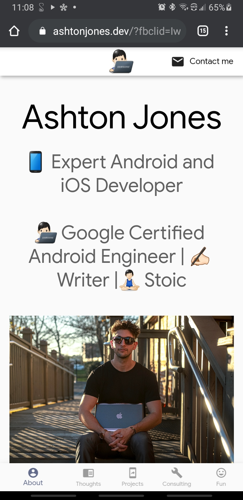
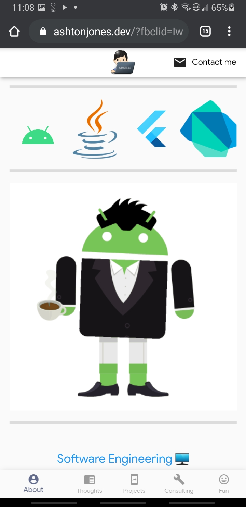
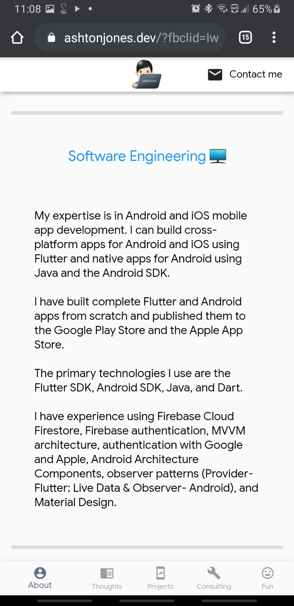
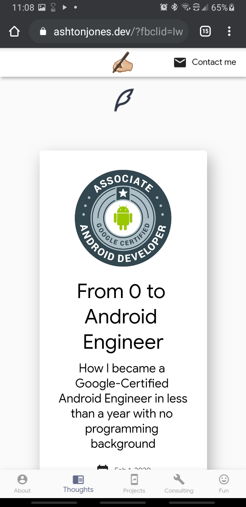
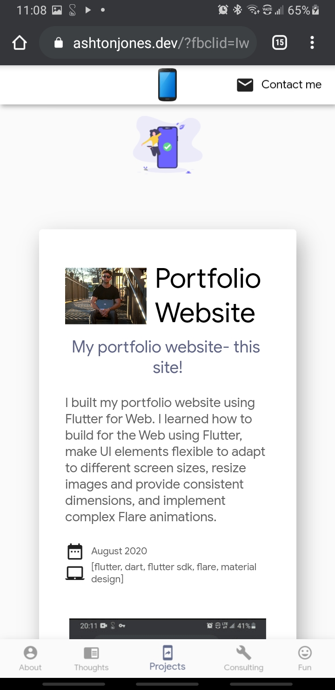
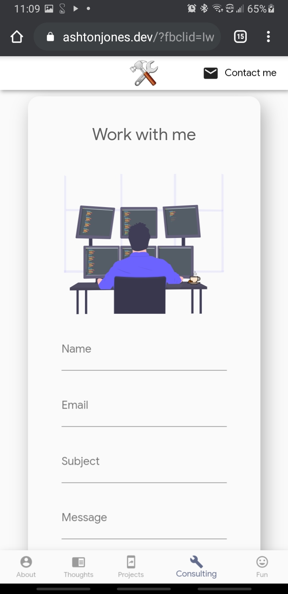

# 👨🏻‍💻 Ashton Jones Dev Website

-------
My portfolio website built with Flutter!

## 🚀 Motivation
I wanted to redesign my portfolio website. I created a minimalist design to showcase my work and animations to make it more inviting.

## 🖥 Technologies used

<b>Built with</b>
- Flutter SDK
- Dart
- [Rive/Flare](https://rive.app/explore/popular/trending/all)
- [Material Design](https://material.io/)

## 📚 Libraries used

* [http](https://pub.dev/packages/http)
* [enough_mail](https://pub.dev/packages/enough_mail)
* [mailto](https://pub.dev/packages/mailto)
* [url_launcher](https://pub.dev/packages/url_launcher)
* [flare_flutter](https://pub.dev/packages/flare_flutter)
* [rive](https://pub.dev/packages/rive)  

## 👨🏻‍💻 Developed By
[Ashton Jones](https://www.ashtonjones.dev/) 

👨‍💻 Google Certified Android Engineer |
✍ Writer |
🧘‍♂️ Stoic
👨🏻‍💻 Ashton Jones
📩 ashtonjonesdev@gmail.com
🌐 www.ashtonjones.dev

Copyright 2020 Ashton Jones

## 📸 Screenshots
&ensp;&ensp;&ensp;
------
&ensp;&ensp;&ensp;

